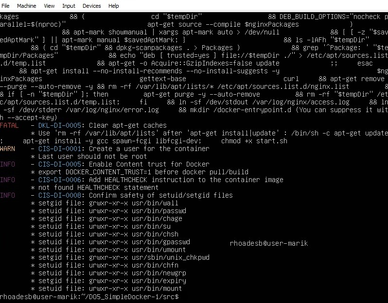

## Part 1. Готовый докер

1.1 Получим официальный образ Docker с установленным Nginx, используя команду `docker pull` для загрузки.

1.2 Проверить, есть ли образ Docker с помощью команды `docker images`.

1.3 Запустить контейнер Docker с использованием команды `docker run -d [image_id|repository]`.

1.4 Убедиться в том, что контейнер запущен с помощью команды docker ps.


1.5 Просмотреть информацию о контейнере с использованием команды docker inspect [container_id|container_name].

- Так как вывод команды достаточно обширен, давайте сохраним его в текстовый файл и воспользуемся поиском в nano для определения `размера контейнера`, `списка прокинутых портов` и `IP-адреса контейнера`.


1.6 Прекратить выполнение контейнера Docker при помощи команды `docker stop [container_id|container_name]`.

1.7 Убедиться в том, что контейнер остановлен, с помощью команды `docker ps`


1.8 Запустим Docker с портами 80 и 443 в контейнере, отображенными на соответствующие порты на локальной машине, с использованием команды docker run.

1.9 Проверить, что стартовая страница Nginx доступна в браузере по адресу localhost:80.


1.10 Перезапустить контейнер Docker с помощью команды `docker restart [container_id|container_name]`.

1.11 Проверить любым способом, что контейнер запустился


## Part 2. Операции с контейнером

Докер-образ и контейнер готовы. Теперь мы можем изучить конфигурацию Nginx и отобразить статус страниц.

- Для начала я создам новый контейнер, присвоив ему имя, чтобы в дальнейшем было удобнее


2.1 Прочитать конфигурационный файл nginx.conf внутри контейнера Docker с помощью команды `docker exec`.


2.2 Создать на локальной машине файл `nginx.conf`

2.3 Настроить в нем по пути `/status` отдачу страницы статуса сервера nginx

- За основу я беру файл `nginx.conf` из контейнера, куда дописываю: 

```c
server {
    location = /status {  // Блок конфигурации, предназначенный для обработки запросов по пути /status, содержит в себе настройки для обработки указанных запросов.
        stub_status  // Директива, включающая отображение страницы статуса сервера Nginx, позволяет серверу отдавать страницу с текущей статистикой и состоянием при обращении к пути /status.
    }:
};
```


2.4 Скопировать созданный файл nginx.conf внутрь докер образа через команду `docker cp`

2.5 Перезапустить nginx внутри докер образа через команду `docker exec`

2.6 Проверить, что по адресу `localhost:80/status` отдается страничка со статусом сервера nginx


2.7 Экспортировать контейнер в файл с именем `container.tar` при помощи команды `export`.

2.8 Остановить контейнер

  

2.9 Удалить образ через `docker rmi [image_id|repository]`, не удаляя перед этим контейнеры

2.10 Удалить остановленный контейнер

  

2.11 Импортировать контейнер обратно через команду `docker import`

- `["nginx", "-g", "daemon off;"]` гарантирует, что Nginx останется в "foreground", чтобы Docker мог правильно отслеживать процесс (в противном случае контейнер остановится сразу после запуска).

2.12 Запустить импортированный контейнер

2.13 Проверить, что по адресу `localhost:80/status` отдается страничка со статусом сервера nginx


## Part 3. Мини веб-сервер

Настало время немного оторваться от докера, чтобы подготовиться к последнему этапу. Настало время написать свой сервер.

3.1 Написать мини сервер на C и FastCgi, который будет возвращать простейшую страничку с надписью Hello World!


3.2 Написать свой nginx.conf, который будет проксировать все запросы с 81 порта на 127.0.0.1:8080


3.3 Запустить написанный мини сервер через spawn-fcgi на порту 8080

- Для этого сначала запускаем контейнер с замапленным портом 81          


- Далее клонируем репозиторий с server.c и nginx.conf, копируем эти файлы в контейнер


- Заходим в контейнер и устанавливаем необходимые для запуска сервера библиотеки


- Компилируем библиотеку, запускаем сервер и обновляемся


3.4 Проверить, что в браузере по localhost:81 отдается написанная страничка


3.5 Положить файл nginx.conf по пути ./nginx/nginx.conf (это понадобится позже)

## Part 4. Свой докер

Теперь всё готово. Можно приступать к написанию докер образа для созданного сервера.

4.1 Соберем свой докер.
1) собирает исходники мини сервера на FastCgi из Части 3
2) запускает его на 8080 порту
3) копирует внутрь образа написанный ./nginx/nginx.conf
4) запускает nginx.

- Сначала пишем start.sh, в котором записываем команды для ENTRYPOINT. Entrypoint в Dockerfile определяет команды, которые будут запущены при запуске контейнера из образа.


- Создаем Dockerfile


4.2 Собрать написанный докер образ через docker build при этом указав имя и тег 


4.3 Проверить через docker images, что все собралось корректно  


4.4 Запустить собранный докер образ с маппингом 81 порта на 80 на локальной машине и маппингом папки ./nginx внутрь контейнера по адресу, где лежат конфигурационные файлы nginx'а (см. Часть 2)  


4.5 Проверить, что по localhost:80 доступна страничка написанного мини сервера


4.6 Дописать в ./nginx/nginx.conf проксирование странички /status, по которой надо отдавать статус сервера nginx


4.7 Перезапустить докер образ

4.8 Проверить, что теперь по localhost:80/status отдается страничка со статусом nginx


## Part 5. **Dockle**

После написания образа никогда не будет лишним проверить его на безопасность.

- Скачиваем Dockle 


5.1 Просканировать образ из предыдущего задания через `dockle [image_id|repository]`

- Для сканирования вводилась команда dockle myimage:v2 (т.е. с образом из 4 части)



5.2 Исправить образ так, чтобы при проверке через **dockle** не было ошибок и предупреждений

- В Dockerfile был изменен USER с root на nginx
- Был добавлен HEALTHCHECK для проверок образа
- Изменены разрешения для файлов в соответствии с требованием Dockle
- Dockle не понравились ключи nginx, но нам они нужны, поэтому при вызове Dockle-проверки мы сделаем для них исключения 


## Part 6. Базовый **Docker Compose**

Вот вы и закончили вашу разминку. А хотя погодите...
Почему бы не поэкспериментировать с развёртыванием проекта, состоящего сразу из нескольких докер образов?

6.1 Написать файл *docker-compose.yml*, с помощью которого:
1) Поднять докер контейнер из 5 части _(он должен работать в локальной сети, т.е. не нужно использовать инструкцию **EXPOSE** и мапить порты на локальную машину)_
2) Поднять докер контейнер с **nginx**, который будет проксировать все запросы с 8080 порта на 81 порт первого контейнера

6.2 Замапить 8080 порт второго контейнера на 80 порт локальной машины


- Также создаем необходимые файлы в специально отведенной директории (docker-compose) для того, чтобы поднять nginx:


6.3 Остановить все запущенные контейнеры


6.4 Собрать и запустить проект с помощью команд `docker-compose build` и `docker-compose up`

6.5 Проверить, что в браузере по *localhost:80* отдается написанная вами страничка, как и ранее


